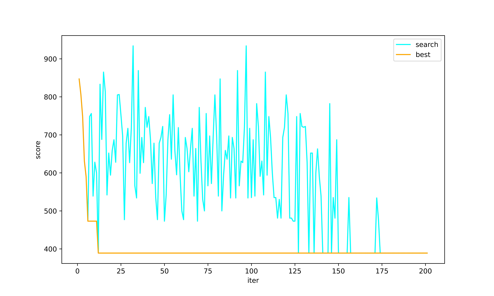
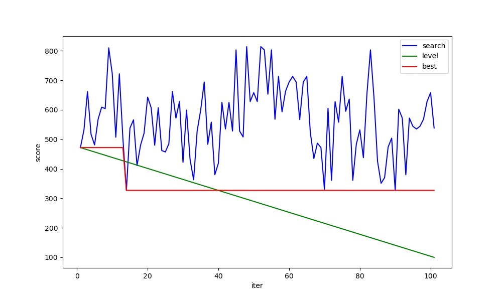

### Map Define

```java
private static final Map<Integer, Map<Integer, Integer>> tspMap = new HashMap<>() {{
put(1, new HashMap<>() {{
    put(2, 200);
    put(3, 68);
    put(4, 99);
    put(5, 85);
    put(6, 62);
}});
put(2, new HashMap<>() {{
    put(1, 200);
    put(3, 230);
    put(4, 75);
    put(5, 70);
    put(6, 165);
}});
put(3, new HashMap<>() {{
    put(1, 68);
    put(2, 230);
    put(4, 88);
    put(5, 55);
    put(6, 120);
}});
put(4, new HashMap<>() {{
    put(1, 99);
    put(2, 75);
    put(3, 88);
    put(5, 175);
    put(6, 59);
}});
put(5, new HashMap<>() {{
    put(1, 85);
    put(2, 70);
    put(3, 55);
    put(4, 175);
    put(6, 110);
}});
put(6, new HashMap<>() {{
    put(1, 62);
    put(2, 165);
    put(3, 120);
    put(4, 59);
    put(5, 110);
}});
}};
```

#### SA
In order to ensure the same number of iterations, the external circulation uses a fixed number of times, not depending on the target temperature

search best score: 389
search best path: 1,2,3,4,5,6,1 
```
Double DELTA = 0.95;
Double T = 1000.0;
Integer outSearchTime = 100;
Integer inSearchTime = 50;

/**
* default
*/
ArrayList<Integer> bestPath = new ArrayList<>();
ArrayList<Integer> bestList = new ArrayList<>();
ArrayList<Integer> searchList = new ArrayList<>();

bestPath.add(1);
bestPath.add(2);
bestPath.add(3);
bestPath.add(4);
bestPath.add(5);
bestPath.add(6);
Collections.shuffle(bestPath);

Integer bestScore = score(bestPath);
bestList.add(bestScore);
searchList.add(bestScore);

/**
* out search
*/
for (int out=0; out<outSearchTime; out++) {
    Random r = new Random(2);

    Integer currentBestScore = bestScore;
    ArrayList<Integer> currentBestPath = bestPath;

    /**
    * in search
    */
    for (int i=0; i<inSearchTime; i++) {

        //new path
        ArrayList<Integer> currentPath = newPath(bestPath);
        Integer currentScore = score(currentPath);

        /**
        * new path better, use
        * or random use
        */
        if(currentScore < bestScore) {
            currentBestPath = currentPath;
            currentBestScore = currentScore;
            break;

        } else {
            Double rd = r.nextDouble();
            double p = Math.exp(-Math.abs(currentBestScore - currentScore) / T);

            if(p > rd) {
                currentBestPath = currentPath;
                currentBestScore = currentScore;
                break;
            }
        }
    }

    System.out.println("INNER END:  current score: " + currentBestScore + "current path: " + currentBestPath.toString());

    searchList.add(currentBestScore);

    if(currentBestScore < bestScore) {
        bestScore = currentBestScore;
        bestPath = currentBestPath;
    }

    bestList.add(bestScore);

    T = T * DELTA;
}
```


#### GD
search best score: 389
search best path: 1, 4, 2, 5, 3, 6 
```
Integer maxIter = 200;
Integer estQuality = 20;

/**
    * default
    */
ArrayList<Integer> bestPath = new ArrayList<>();
ArrayList<Integer> bestList = new ArrayList<>();
ArrayList<Integer> acceptList = new ArrayList<>();
ArrayList<Double> levelList = new ArrayList<>();

bestPath.add(1);
bestPath.add(2);
bestPath.add(3);
bestPath.add(4);
bestPath.add(5);
bestPath.add(6);
Collections.shuffle(bestPath);

Integer bestScore = score(bestPath);
Double LEVEL = Double.valueOf(bestScore);
Double UP = (LEVEL - estQuality)/maxIter;

bestList.add(bestScore);
acceptList.add(bestScore);
levelList.add(LEVEL);

Integer acceptScore = bestScore;
ArrayList<Integer> acceptPath = bestPath;

for (int i=0; i<maxIter; i++) {

    //new path
    ArrayList<Integer> currentPath = newPath(acceptPath);
    Integer currentScore = score(currentPath);

    System.out.println("i=" + i + " current score: " + currentScore + " current path: " + currentPath.toString());

    if(currentScore < bestScore) {
        acceptScore = currentScore;
        acceptPath = currentPath;
        bestScore = currentScore;

        bestPath = currentPath;
    } else if (currentScore < LEVEL) {
        acceptScore = currentScore;
        acceptPath = currentPath;

        bestPath = currentPath;
    }

    acceptList.add(acceptScore);
    bestList.add(bestScore);


    LEVEL = LEVEL - UP;

    BigDecimal b = new BigDecimal(LEVEL);
    levelList.add(b.setScale(2, BigDecimal.ROUND_HALF_UP).doubleValue());
}
```



