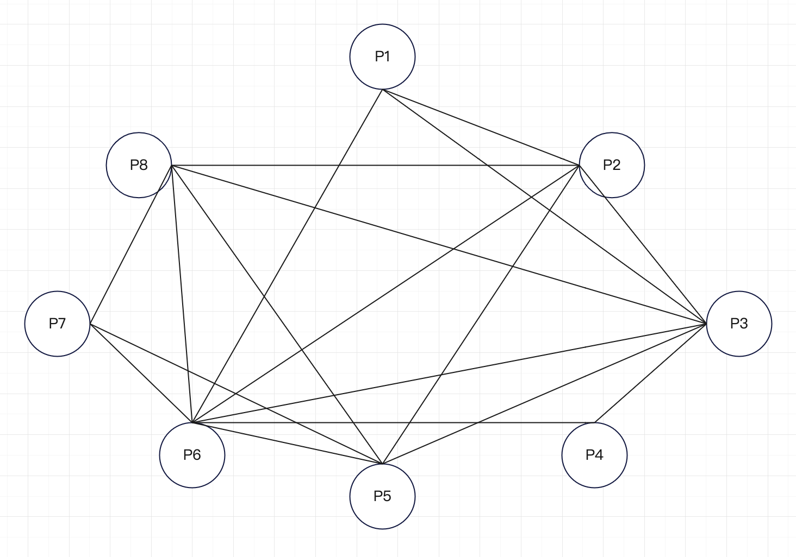

#### graph



#### Pseudocode
```
// default value
day, slot, room = 1;
allMeetingList = [P1,P2,P3,P4,P5,P6,P7,P8]
arrangeMap = {1:{1:{}, 2{}}, 2:{1:{}, 2{}, 3:{1:{}, 2{}}};

while(!allMeetingList.isEmpty()) {
    //Check hard constraints
    openMeetingList = getOpenMeetingByArrange(arrangeMap);

    //have meeting to arrange
    if(!openMeetingList.isEmpty()) {
        scoreList = estimatedCost(openMeetingList);
        
        Select the lowest;

        arrnageMap{day}{slot}{room} = lowestMeeting;

        deleteHasThisMeeting's researcher; 
    }

    day,slot,room = getNext();
}
```

#### Solution
select meeting = P6, arrange = {1={1={1=P5, 2=P4}, 2={1=P3, 2=P7}}, 2={1={1=P8, 2=P1}, 2={1=P2, 2=EMPTY}}, 3={1={1=P6, 2=null}, 2={1=null, 2=null}}}
i1 = 14, i2 = 0, i3 = 2
result score = 16

#### Code
```Java
package project1;

import java.util.*;

public class Project1 {

    static String emptyMeeting = "EMPTY";

    static List<String> allMeetings = new ArrayList<>() {{
        add("P1");
        add("P2");
        add("P3");
        add("P4");
        add("P5");
        add("P6");
        add("P7");
        add("P8");
    }};
    /**
     * meeting and has the same user meeting
     */
    static Map<String, ArrayList<String>> graph = new HashMap<>() {{
        put("P1", new ArrayList<>() {{
            add("P2");
            add("P3");
            add("P6");
        }});
        put("P2", new ArrayList<>() {{
            add("P1");
            add("P3");
            add("P5");
            add("P6");
            add("P8");
        }});
        put("P3", new ArrayList<>() {{
            add("P1");
            add("P2");
            add("P4");
            add("P5");
            add("P6");
            add("P8");
        }});
        put("P4", new ArrayList<>() {{
            add("P3");
            add("P6");
        }});
        put("P5", new ArrayList<>() {{
            add("P2");
            add("P3");
            add("P6");
            add("P7");
            add("P8");
        }});
        put("P6", new ArrayList<>() {{
            add("P1");
            add("P2");
            add("P3");
            add("P4");
            add("P5");
            add("P7");
            add("P8");
        }});
        put("P7", new ArrayList<>() {{
            add("P5");
            add("P6");
            add("P8");
        }});
        put("P8", new ArrayList<>() {{
            add("P2");
            add("P3");
            add("P5");
            add("P6");
            add("P7");
        }});
    }};

    /**
     * researchers and meetings
     */
    static Map<Integer, ArrayList<String>> researchers = new HashMap<>() {{
        put(1, new ArrayList<>() {{
            add("P1");
            add("P2");
            add("P3");
            add("P6");
        }});
        put(2, new ArrayList<>() {{
            add("P2");
            add("P3");
        }});
        put(3, new ArrayList<>() {{
            add("P2");
            add("P3");
            add("P5");
            add("P8");
        }});
        put(4, new ArrayList<>() {{
            add("P4");
            add("P6");
        }});
        put(5, new ArrayList<>() {{
            add("P1");
            add("P6");
        }});
        put(6, new ArrayList<>() {{
            add("P1");
            add("P3");
            add("P4");
            add("P6");
        }});
        put(7, new ArrayList<>() {{
            add("P7");
            add("P8");
        }});
        put(8, new ArrayList<>() {{
            add("P5");
            add("P7");
        }});
        put(9, new ArrayList<>() {{
            add("P1");
            add("P2");
        }});
        put(10, new ArrayList<>() {{
            add("P5");
            add("P6");
            add("P7");
            add("P8");
        }});
    }};
    static Map<Integer, ArrayList<String>> researcherDelete = new HashMap<>() {{
        put(1, new ArrayList<>() {{
            add("P1");
            add("P2");
            add("P3");
            add("P6");
        }});
        put(2, new ArrayList<>() {{
            add("P2");
            add("P3");
        }});
        put(3, new ArrayList<>() {{
            add("P2");
            add("P3");
            add("P5");
            add("P8");
        }});
        put(4, new ArrayList<>() {{
            add("P4");
            add("P6");
        }});
        put(5, new ArrayList<>() {{
            add("P1");
            add("P6");
        }});
        put(6, new ArrayList<>() {{
            add("P1");
            add("P3");
            add("P4");
            add("P6");
        }});
        put(7, new ArrayList<>() {{
            add("P7");
            add("P8");
        }});
        put(8, new ArrayList<>() {{
            add("P5");
            add("P7");
        }});
        put(9, new ArrayList<>() {{
            add("P1");
            add("P2");
        }});
        put(10, new ArrayList<>() {{
            add("P5");
            add("P6");
            add("P7");
            add("P8");
        }});
    }};

    /**
     * 3day -> 2slots -> 2room
     */
    static Map<Integer, Map<Integer, Map<Integer, String>>> arrangeMap = new HashMap<>() {{
        put(1, new HashMap<>() {{
            put(1, new HashMap<>() {{
                put(1, null);
                put(2, null);
            }});
            put(2, new HashMap<>() {{
                put(1, null);
                put(2, null);
            }});
        }});
        put(2, new HashMap<>() {{
            put(1, new HashMap<>() {{
                put(1, null);
                put(2, null);
            }});
            put(2, new HashMap<>() {{
                put(1, null);
                put(2, null);
            }});
        }});
        put(3, new HashMap<>() {{
            put(1, new HashMap<>() {{
                put(1, null);
                put(2, null);
            }});
            put(2, new HashMap<>() {{
                put(1, null);
                put(2, null);
            }});
        }});
    }};

    /**
     * Actual cost
     * 实际代价
     */
    static Integer actualCost(Map<Integer, Map<Integer, Map<Integer, String>>> arrangeMap, Boolean isEnd) {

        ArrayList<String> meetings = new ArrayList<>();
        Map<Integer, LinkedHashSet<String>> currentDayMap = new HashMap<>();

        for (int day = 1; day <= arrangeMap.size(); day++) {
            currentDayMap.put(day, new LinkedHashSet<>());

            for (int slot = 1; slot <= arrangeMap.get(day).size(); slot++) {
                for (int room = 1; room <= arrangeMap.get(day).get(slot).size(); room++) {
                    String currentMeeting = arrangeMap.get(day).get(slot).get(room);

                    //If it is empty, it indicates that it has not been arranged here
                    //如果是空，表明还没有安排到这里
                    if (!Objects.isNull(currentMeeting)) {
                        meetings.add(currentMeeting);
                        currentDayMap.get(day).add(currentMeeting);
                    }
                }
            }
        }

        Iterator<String> iterator = meetings.iterator();
        while (iterator.hasNext()){
            String next = iterator.next();
            if (emptyMeeting.equals(next)) {
                iterator.remove();
            }
        }

        /**
         * cal i: n penalty is given if the researcher is idle (does not attend a meeting
         * between two meetings) for n timeslots (i.e., n=1,2,3,...).
         * 如果研究者在n个时隙（即，n＝1，2，3，…）内空闲（不参加两次会议之间的会议），则给予n个惩罚。
         */
        Map<Integer, ArrayList<String>> re;
        if(isEnd) {
            re = researchers;
        } else {
            re =researcherDelete;
        }
        Integer i1 = 0;

        i1Over:
        {
            for (int day = 1; day <= arrangeMap.size(); day++) {
                Integer dayScore = 0;

                for (int slot = 1; slot <= arrangeMap.get(day).size(); slot++) {
                        String currentMeeting1 = arrangeMap.get(day).get(slot).get(1);
                        String currentMeeting2 = arrangeMap.get(day).get(slot).get(2);

                        if (Objects.isNull(currentMeeting1) && Objects.isNull(currentMeeting2)) {
                            break i1Over;
                        }

                        //If there is this researcher in the current meeting, delete his meeting
                        //如果当前会议有这个研究人员的，删除他的会议
                        List<Integer> reList = new ArrayList<>();
                        for (Integer reId : re.keySet()) {
                            if(!re.get(reId).isEmpty() && re.get(reId).contains(currentMeeting1)) {
                                reList.add(reId);
                                re.get(reId).remove(currentMeeting1);
                            }
                            if(!re.get(reId).isEmpty() && re.get(reId).contains(currentMeeting2)) {
                                reList.add(reId);
                                re.get(reId).remove(currentMeeting2);

                            }
                        }

                        //重新循环查找会议人员，如果他不在会议列表里，但是还有剩余会议，需要加分
                        //Re-cycle to find the meeting person. If he is not in the meeting list,
                        //but there are still remaining meetings, additional points are required
                        for (Integer reId: re.keySet()) {
                            if(!re.get(reId).isEmpty() && !reList.contains(reId)) {
                                dayScore ++;
                            }
                        }

                    }
                System.out.println("day = " + day + ", i1 = " + dayScore);
                i1 += dayScore;
            }
        }

        /**
         * cal ii: If a researcher has only one meeting scheduled per day, they lose one
         * point (whereas he actually has more than one project meeting).
         * 如果研究人员每天只安排一次会议，他们会失去一分
         */
        Integer i2 = 0;
        for (int i=1; i<=re.size(); i++) {
            for (int day = 1; day <= arrangeMap.size(); day++) {
                LinkedHashSet<String> currentDay = currentDayMap.get(day);

                //cross
                List<String> copy = new ArrayList<>(re.get(i));
                copy.retainAll(currentDay);

                if(copy.size() == 1) {
                    i2++;
                }
            }
        }

        /**
         * iii: Every day D1 or D2 when a room is unoccupied, there will be a two-point penalty (not reserved for a meeting).
         * 每天D1或D2房间无人时，将处以两分罚款
         */
        Integer i3 = 0;

        ArrayList d1AndD2 = new ArrayList<>() {{
            add(1);
            add(2);
        }};
        for (int day = 1; day <= d1AndD2.size(); day++) {
            for (int slot = 1; slot <= arrangeMap.get(day).size(); slot++) {
                for (int room = 1; room <= arrangeMap.get(day).get(slot).size(); room++) {
                    String currentMeeting = arrangeMap.get(day).get(slot).get(room);

                    if(emptyMeeting.equals(currentMeeting) || Objects.isNull(currentMeeting)) {
                        i3 += 2;
                    }
                }
            }
        }

        System.out.println("i1 = " + i1 + ", i2 = " + i2 + ", i3 = " + i3);

        return i1 + i2 + i3;
    }

    /**
     * Estimated cost
     * 预估代价
     */
    static Map<String, Integer> estimatedCost(Map<Integer, Map<Integer, Map<Integer, String>>> currentArrangeMap, List<String> openList) {
        Map<String, Integer> solution = new HashMap<>();

        Integer G = actualCost(currentArrangeMap, false);

        Over:
        {
            for (int day = 1; day <= arrangeMap.size(); day++) {
                for (int slot = 1; slot <= arrangeMap.get(day).size(); slot++) {
                    for (int room = 1; room <= arrangeMap.get(day).get(slot).size(); room++) {
                        String currentMeeting = arrangeMap.get(day).get(slot).get(room);

                        //If it is empty, arrange here
                        //如果是空，安排
                        if (Objects.isNull(currentMeeting)) {

                            Integer D = day;
                            Integer S = slot;
                            Integer R = room;

                            if(room == 1) {
                                if(slot == 1) {
                                    if(D > 1) {
                                        //前一天的最后一个
                                        D = Math.min(1, day - 1);
                                        R = 2;
                                        S = 2;
                                    }
                                } else {
                                    S = Math.min(1, slot - 1);
                                    R = 2;
                                }
                            } else {
                                R = Math.min(1, room-1);
                            }


                            /**
                             * every open meeting cal
                             * 每个会议搜索一次
                             */
                            for (String meeting : openList) {

                                Map<Integer, Map<Integer, Map<Integer, String>>> testMap = new HashMap<>(currentArrangeMap);
                                testMap.get(day).get(slot).put(room, meeting);
                                /**
                                 * Directly arrange to calculate the score that will be increased
                                 * 已知如果这么安排会增加的罚分
                                 */
                                Integer addSol = actualCost(testMap, false);

                                /**
                                 * Predict how many points will be fined if this arrangement is made
                                 * 预测如果这样安排会有多少罚分
                                 */
                                List<String> unArrangeList = new ArrayList<>(openList);
                                unArrangeList.remove(meeting);

                                for (int i = 0; i<unArrangeList.size(); i++) {
                                    List<String> A;
                                    if(i == 0) {
                                        A = new ArrayList<>(graph.get(meeting));
                                    } else {
                                        A = new ArrayList<>(graph.get(unArrangeList.get(i-1)));
                                    }

                                    List<String> B = new ArrayList<>(graph.get(unArrangeList.get(i)));

                                    A.retainAll(B);

                                    //之后的所有有变化的差集都有可能导致加分
                                    addSol += A.size();
                                }

                                /**
                                 * Not all difference sets will change, depending on the order of arrangement,
                                 * so we need to reduce or increase the weight according to experience
                                 * 不是所有差集都会有变化，取决于安排的顺序，所以这里需要根据经验进行一定权重的下降或增长
                                 */
                                //addSol /= 2;

                                /**
                                 * ii
                                 */
                                for(List<String> meetings : researchers.values()){
                                    if(meetings.contains(meeting)) {
                                        addSol += 2;
                                    }
                                }

                                /**
                                 * iii
                                 */
                                //D1 & D2
                                for (int dd = 1; dd <= 2; dd++) {

                                    DDD:
                                    {
                                        for (int ss = 1; ss <= testMap.get(dd).size(); ss++) {
                                            for (int rr = 1; rr <= testMap.get(dd).get(ss).size(); rr++) {
                                                if (Objects.isNull(testMap.get(dd).get(ss).get(rr))) {
                                                    addSol += 2;

                                                    break DDD;
                                                }
                                            }
                                        }
                                    }
                                }

                                solution.put(meeting, addSol);
                            }


                            break Over;
                        }
                    }
                }
            }
        }


        return solution;
    }

    /**
     * !!! Hard constraint
     * Next allowed meeting
     * @param arrangeMap
     * @return
     */
    static List<String> openList(Map<Integer, Map<Integer, Map<Integer, String>>> arrangeMap) {
        List<String> openList = new ArrayList<>(allMeetings);
        ArrayList<String> meetings = new ArrayList<>();


        for (int day = 1; day <= arrangeMap.size(); day++) {
            for (int slot = 1; slot <= arrangeMap.get(day).size(); slot++) {
                for (int room = 1; room <= arrangeMap.get(day).get(slot).size(); room++) {
                    String currentMeeting = arrangeMap.get(day).get(slot).get(room);

                    //If it is empty, it indicates that it has not been arranged here
                    //如果是空，表明还没有安排到这里
                    if (!Objects.isNull(currentMeeting)) {
                        meetings.add(currentMeeting);
                    }
                }
            }
        }

        /**
         * Get the list of unscheduled meetings
         * 取没安排的会议列表
         */
        openList.removeAll(meetings);

        Over:
        {
            for (int day = 1; day <= arrangeMap.size(); day++) {
                for (int slot = 1; slot <= arrangeMap.get(day).size(); slot++) {
                    for (int room = 1; room <= arrangeMap.get(day).get(slot).size(); room++) {
                        String currentMeeting = arrangeMap.get(day).get(slot).get(room);

                        //If it is empty, arrange here
                        //如果是空，安排
                        if (Objects.isNull(currentMeeting)) {

                            //If it is the second room, you need to check the conflict with the first room
                            //如果当前是第二个房间，需要检查和第一个房间的冲突
                            if(room == 2) {
                                String room1Meeting = arrangeMap.get(day).get(slot).get(1);
                                List<String> conflict = graph.get(room1Meeting);

                                openList.removeAll(conflict);
                            }

                            break Over;
                        }

                        meetings.add(currentMeeting);
                    }
                }
            }
        }

        return openList;
    }

    public static String eval(Map<Integer, Map<Integer, Map<Integer, String>>> arrangeMap, List<String> openList) {
        Integer gEval = actualCost(arrangeMap, false);

        Map<String, Integer> solList = estimatedCost(arrangeMap, openList);
        System.out.println("sol list = " + solList);

        String meeting = null;
        Integer sol = gEval;

        for(String mapKey : solList.keySet()){
            if(Objects.isNull(meeting) || solList.get(mapKey) < sol) {
                meeting = mapKey;
                sol = solList.get(mapKey);
            }
        }

        System.out.println("sol = " + sol + ", meeting = " + meeting);
        return meeting;
    }

    public static <string> void main(String[] args) {

        List<String> allList = new ArrayList<>(allMeetings);
        Integer D = 1;
        Integer S = 1;
        Integer R = 1;

        while(!allList.isEmpty()) {

            List<String> openList = openList(arrangeMap);
            String meeting = null;

            if(!openList.isEmpty()) {
                meeting = eval(arrangeMap, openList);
                for (List<String> researcherList : researcherDelete.values()) {
                    researcherList.remove(meeting);
                }

            } else {
                meeting = emptyMeeting;
            }

            arrangeMap.get(D).get(S).put(R, meeting);
            System.out.println("select meeting = " + meeting + ", arrange = " + arrangeMap);
            allList.remove(meeting);

            if(R == 1) {
                R = 2;
            } else if (S == 1) {
                S = 2;
                R = 1;
            } else {
                D ++;
                S = 1;
                R = 1;
            }
        }

        System.out.println("result score = " + actualCost(arrangeMap, true));
    }
}
```


