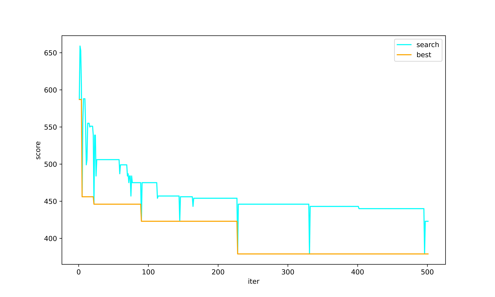

#### TSP Map


#### Search Process 


#### Code
```Java
package project2;

import Tool.Tool;

import java.io.IOException;
import java.util.*;

public class Project2 {
    private static final Map<Integer, Map<Integer, Integer>> tspMap = new HashMap<>() {{
        put(1, new HashMap<>() {{
            put(2, 174);
            put(3, 88);
            put(4, 54);
            put(5, 23);
            put(6, 62);
            put(7, 140);
        }});
        put(2, new HashMap<>() {{
            put(1, 174);
            put(3, 79);
            put(4, 75);
            put(5, 70);
            put(6, 130);
            put(7, 143);
        }});
        put(3, new HashMap<>() {{
            put(1, 88);
            put(2, 79);
            put(4, 88);
            put(5, 55);
            put(6, 120);
            put(7, 23);
        }});
        put(4, new HashMap<>() {{
            put(1, 54);
            put(2, 75);
            put(3, 88);
            put(5, 66);
            put(6, 59);
            put(7, 63);
        }});
        put(5, new HashMap<>() {{
            put(1, 23);
            put(2, 70);
            put(3, 55);
            put(4, 66);
            put(6, 110);
            put(7, 142);
        }});
        put(6, new HashMap<>() {{
            put(1, 62);
            put(2, 130);
            put(3, 120);
            put(4, 59);
            put(5, 110);
            put(7, 115);
        }});

        put(7, new HashMap<>() {{
            put(1, 140);
            put(2, 143);
            put(3, 23);
            put(4, 63);
            put(5, 142);
            put(6, 115);
        }});
    }};


    static Integer HMS = 5;
    static Double HMCR = 0.5;

    static Double PAR = 0.1;

    static Integer NI = 500;

    private static final ArrayList<Integer> scoreList = new ArrayList<>(NI);


    public static <string> void main(String[] args) throws IOException {

        ArrayList<ArrayList<Integer>> hmsArr = new ArrayList<>();
        Map<Integer, ArrayList<Integer>> hmsMap = new TreeMap<>();

        ArrayList<Integer> hmsBest = new ArrayList<>();
        ArrayList<Integer> search  = new ArrayList<>();
        ArrayList<Integer> accept  = new ArrayList<>();

        /**
         * init HMS
         */
        for (int i=0; i<HMS; i++) {
            ArrayList<Integer> defaultPath = new ArrayList<>() {{
                add(1);
                add(2);
                add(3);
                add(4);
                add(5);
                add(6);
                add(7);
            }};
            Collections.shuffle(defaultPath);
            hmsArr.add(defaultPath);
        }

        System.out.println("default hms: " + hmsArr);


        //按从小到大排序，第一个是最小的
        hmsArr.sort(getComparator());
        for (ArrayList<Integer> arrayList : hmsArr) {
            hmsMap.put(score(arrayList), arrayList);
        }

        System.out.println("default hmsMap: " + hmsMap);
        hmsBest.add((Integer) hmsMap.keySet().toArray()[0]);
        scoreList.add((Integer) hmsMap.keySet().toArray()[0]);


        for (int i = 0; i<NI; i++) {
            ArrayList<Integer> newHarmony = improviseHarmony(hmsArr);

            System.out.println("new harmony sol = " + score(newHarmony));

            Integer index = hmsArr.size()-1;

            if (score(newHarmony) < score(hmsArr.get(index))) {
                ArrayList<Integer> old = hmsArr.get(index);

                hmsArr.remove(index.intValue());
                hmsArr.add(index, newHarmony);

                hmsMap.remove(score(old));
                hmsMap.put(score(newHarmony), newHarmony);

                scoreList.add(score(newHarmony));
            } else {
                scoreList.add(score(hmsArr.get(index)));
            }

            System.out.println("hmsMap: " + hmsMap);

            hmsArr.sort(getComparator());

            hmsBest.add((Integer) hmsMap.keySet().toArray()[0]);
        }

        System.out.println(hmsArr);
        System.out.println(score(hmsArr.get(0)));
        System.out.println(scoreList);

        System.out.println(hmsBest);

        Tool.array2CSV(hmsBest, "hm_best.csv");
        Tool.array2CSV(scoreList, "hm_score_list.csv");
    }

    public static ArrayList<Integer> improviseHarmony(ArrayList<ArrayList<Integer>> hmsArr) {
        ArrayList<Integer> newHarmony = new ArrayList<>();

        Random random = (new Random());

        for (int i = 0; i<tspMap.size(); i++) {

            double rnd = random.nextDouble();

            Integer randomSolPoint;

            if (rnd < HMCR) {

                ArrayList<Integer> randomSol = hmsArr.get(random.nextInt(0, hmsArr.size()));
                randomSolPoint = randomSol.get(random.nextInt(0, tspMap.size()));

                if(rnd < PAR) {
                    while (newHarmony.contains(randomSolPoint)) {

                        randomSolPoint = random.nextDouble(0, 1) > 0.5 ? randomSolPoint + 1 : randomSolPoint - 1;

                        if (randomSolPoint < 1) {
                            randomSolPoint = 1;
                            break;
                        }
                        if (randomSolPoint > tspMap.size()) {
                            randomSolPoint = tspMap.size();
                            break;
                        }
                    }
                }

            } else {
                randomSolPoint = random.nextInt(1, tspMap.size()+1);
            }

            Integer c = 0;
            while (newHarmony.contains(randomSolPoint)) {
                c++;
                System.out.println("sol point repeat c="+c + "new = " + newHarmony);

                randomSolPoint = random.nextInt(1, tspMap.size()+1);
            }

            newHarmony.add(i, randomSolPoint);
        }

        return newHarmony;
    }

    private static Comparator<ArrayList<Integer>> getComparator() {

        return Comparator.comparingInt(Project2::score);
    }


    private static Integer score(ArrayList<Integer> arrayList) {
        int sum = 0;

        for(int i=0; i<arrayList.size(); i++) {
            Integer point1 = arrayList.get(i);
            Integer point2;
            if(i == arrayList.size()-1) {
                point2 = arrayList.get(0);
            } else {
                point2 = arrayList.get(i+1);
            }

            sum += tspMap.get(point1).get(point2);
        }

        return sum;
    }

}

```